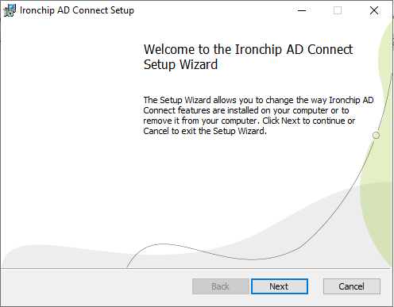
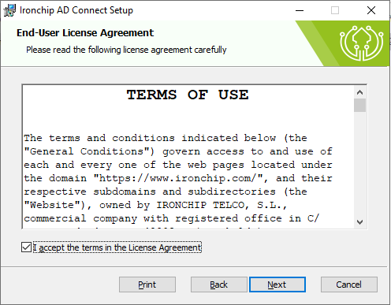
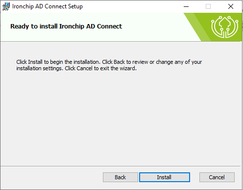
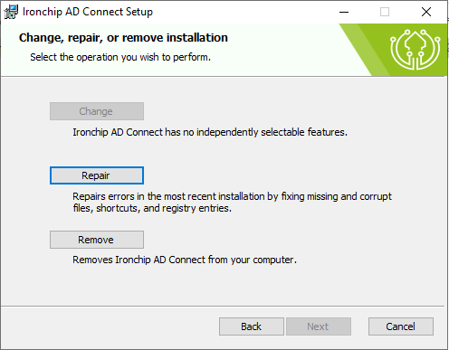
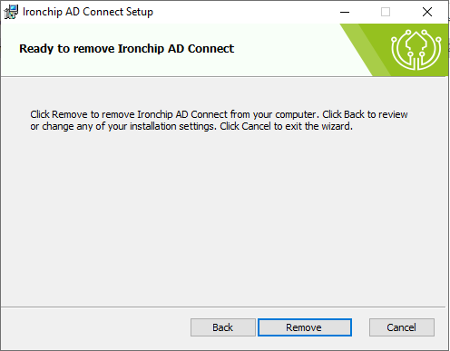

<h1 align="center">Ironchip Windows AD Connect</h1>

<p align="center">
  <a href="https://github.com/Ironchip-Security/Ironchip-Windows-AD-Connect/releases/latest">
    
  </a>

  <a href="https://github.com/Ironchip-Security/Ironchip-Windows-AD-Connect/releases/latest">
    
  </a>
</p>

## IDENTITY PROTECTION

Elevate your cybersecurity strategy with Ironchip Identity Platform, designed to bring the power of Multi-Factor Authentication (MFA) to your desktop computing environment. [Know more](https://www.ironchip.com/en/mobileless-authentication).

**Role-based privilege management:** Set different user privileges to prevent unauthorized users from misusing the system.

**Restrict access from unauthorized places:** Limit access to authorized areas for enhanced security.

**Supervision of accesses in real time:** Monitor user activity, view access history, generate reports, and download them for complete control.

**Intrusion detection system (IDS):** Receive alerts for SIM swapping, phishing, device switching, and more.

---

### Download
Download the latest installer (`.msi`) version from [Release](https://github.com/Ironchip-Security/Ironchip-Windows-AD-Connect/releases).<br><br>
**Latest release:**
<p align="left">
  <a href="https://github.com/Ironchip-Security/Ironchip-Windows-AD-Connect/releases/latest">
    
  </a>
</p>

---

## Installation

### Installation process

To install Ironchip AD Connect into your device:
 1) Run the downloaded installer. This will open the installer stepper:
   <p align="center">
     
   </p>
 2) Read and accept the Terms of Use.
    <p align="center">
     
    </p>
 3) Finally, click the Install button to complete the setup.
    <p align="center">
       
    </p>


### Installation process using CLI
The installation of Ironchip Windows Logon using commands (cmd) with the program "msiexec.exe." Here’s a basic tutorial on how to do it:

1) Open the command line (cmd):
    - Press Win + R to open the "Run" dialog.
    - Type "cmd" and press Enter.
2) Locate the MSI file:
    - Make sure you have the MSI file you want to install in an accessible location from the command line.
3) Execute the msiexec command:
    - The basic command to install an MSI file is as follows:

    ```bash
    msiexec.exe /i Path\To\IronchipADConnect.msi /q
    ```

    Replace "Path\To\IronchipADConnect.msi" with the full path and name of the MSI file.
4) Wait for it to finish:
    - The installation process may take some time. Stay in the command line until you see the prompt indicating that the installation is complete.

Once installed, the service should auto start on boot and can be configured further through a terminal window using `ironchip-ad-connect` as a command

## Configuration

Configure necessary credentials by opening http://localhost:10300 in your preferred browser or by clicking on the shortcut created on your desktop

---

## Uninstall

### Uninstall process
To uninstall Ironchip AD Connect from your device:
1) Run the downloaded installer. This will open the installer stepper:
  <p align="center">
    
  </p>
2) Select the uninstall option:
  <p align="center">
    
  </p>
3) Finally, click the Uninstall button to finish.
  <p align="center">
      
  </p>


### Uninstall process using CLI
To remove Ironchip AD Connect service:

1) Open the command line (cmd):
    - Press Win + R to open the "Run" dialog.
    - Type "cmd" and press Enter.
2) Locate the MSI file:
    - Make sure you have the MSI file you want to install in an accessible location from the command line.
3) Execute the msiexec command:
    - The basic command to uninstall an MSI file is as follows:

    ```bash
    msiexec.exe /x Path\To\IronchipADConnect.msi
    ```

    Replace "Path\To\IronchipADConnect.msi" with the full path and name of the MSI file.
4) Wait for it to finish:
    - The uninstall process may take some time. Stay in the command line until you see the prompt indicating that the uninstall is complete.

## Update

### Update process
To update Ironchip AD Connect on your device:
Run the downloaded newer version of the installer and follow the steps on [Installation process](#installation-process)